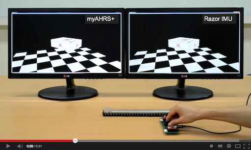
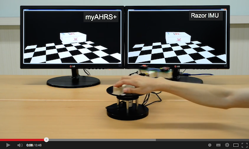
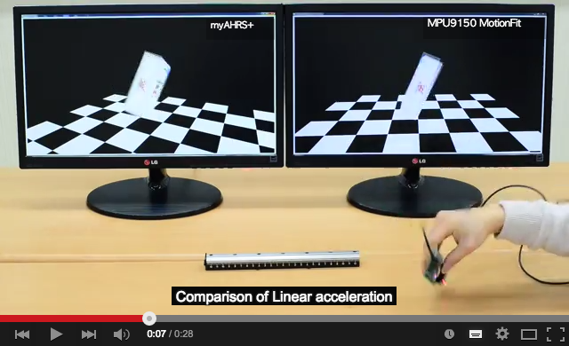
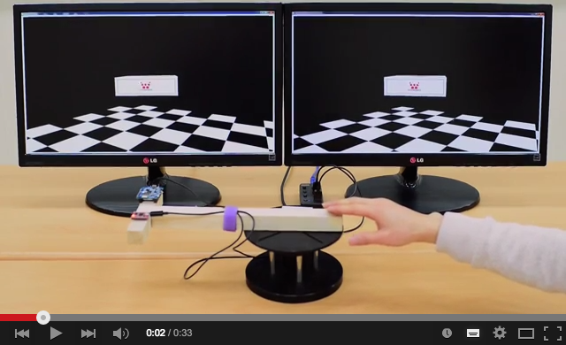

myAHRS+
====================

The myAHRS+ is a low cost high performance AHRS(Attitude Heading Reference System). 
Its attitude output is more stable to acceleration and magnetic disturbances then other low cost AHRS/IMU products. 
Communication and configuration are enabled via UART/USB interface for user applications. And I2C interface is available for embedded application like arduino projects.
The GUI(myAHRS+ Monitor) is available, which allows users configure all myAHRS+  settings, view attitude of myAHRS+ and IMU(Inertial Measurement Unit) data in realtime and save sensor data in a text file. Custom user software may be developed using the myAHRS+ SDK.

## Performance

Performance comparison between myAHRS+ and Razor 9 axis IMU.

Performance comparison between myAHRS+ and MPU9150 MotionFit.

## Tutorial

Detailed description is [here](tutorial).

## Software - myAHRS+ Monitor V1.02
* [myAHRS+ Monitor V1.02](Software)

## Examples

* [myAHRS+ SDK](common_cpp)
* [python](common_python)

* [odroid XU3](odroid_xu3)
* [odroid C1](odroid_c1)

* [Raspberri PI](raspberry_pi)
