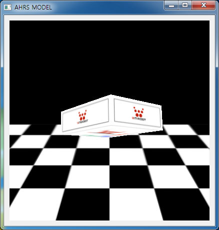

# myAHRS+ pyQT examples

This examples show you how to use the myAHRS+ with pyQT.  

## Requirements

* python 2.7
* pySerial
* PyQt4
* PyOpenGL

## Details of examples  

It is assumed that your myAHRS+ is connected to /dev/ttyACM0(linux) or COM1(windows).

### pyqt_example.py



It displays a box that rotates along with the attitude of the myAHRS+. 

Run this example as follows.

```
$ python pyqt_example.py /dev/ttyACM0
```

Note) Since the ARM-linux does not support PyOpenGL, You can't run this example on odroid(or raspberry pi).  
