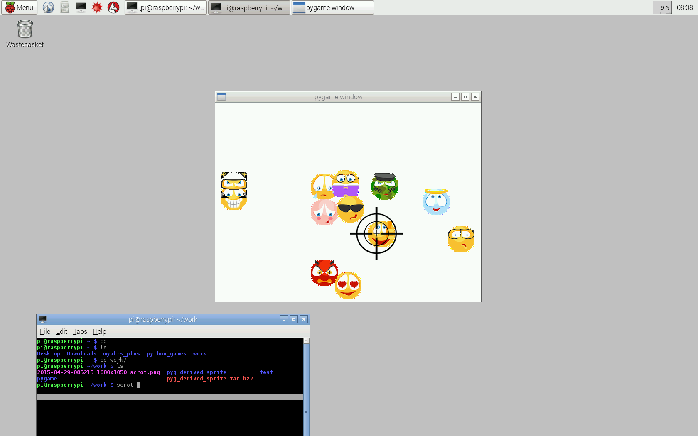
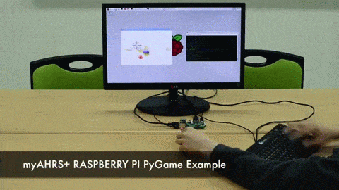

# myAHRS+ pygame examples

This examples show you how to use the myAHRS+ with pygame.  

## Requirements

* pygame
* pySerial 

## Download
Download source from github. 

```
$ cd YOUR_WORKING_DIRECTORY
$ svn export https://github.com/withrobot/myAHRS_plus/trunk/common_python/pygame
```

## Details of examples  

It is assumed that your myAHRS+ is connected to /dev/ttyACM0(linux) or COM1(windows).

### shooting

[](https://youtu.be/zkrVU23q15M)

* Fire : Space key 
* Exit : Escape key 


Run  

```
$ python shooting.py /dev/ttyACM0
```

