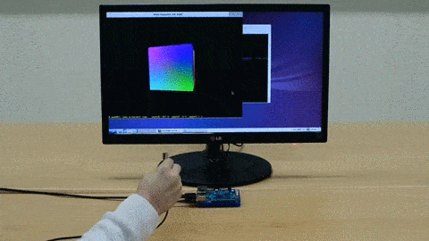

# myAHRS+ examples with OpenGL ES 

These examples show you how to use the myAHRS+ with opengl on your odroid c1. 

## How to build 

Install compiler and subversion client on your odroid.

```
$ sudo apt-get update
$ sudo apt-get install subversion build-essential
```

Download source tree from github. 

```
$ cd YOUR_WORKING_DIRECTORY
$ svn export https://github.com/withrobot/myAHRS_plus/trunk/odroid_c1
```

Build all examples.

```
$ cd odroid_c1/opengles20
$ chmod +x config.sh
$ ./config.sh; make -j4
```


## Details of examples  

It is assumed that your myAHRS+ is connected to /dev/ttyACM0.  

### Cube 

[](https://youtu.be/BRO0Viauv7Q)

This is the simplest example displays the cube that rotates along with the movement of the myAHRS+. 
You can run this example as follows.

```
$ ./samples/opengles_20/cube_with_myahrs/cube_myahrs /dev/ttyACM0
```

