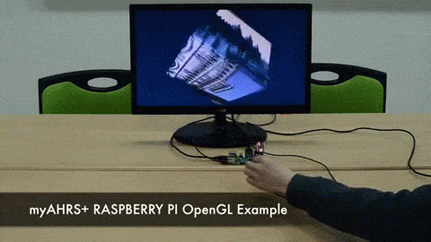

# myAHRS+ examples with OpenGL ES 

These examples show you how to use the myAHRS+ with opengl on your Raspberry PI. 

## How to build 

Install compiler and subversion client on your Raspberry PI.

```
$ sudo apt-get update
$ sudo apt-get install subversion build-essential
$ sudo apt-get install gcc-4.7 g++-4.7
$ sudo update-alternatives --install /usr/bin/gcc gcc /usr/bin/gcc-4.7 40 --slave /usr/bin/g++ g++ /usr/bin/g++-4.7
```

Download source tree from github. 

```
$ cd YOUR_WORKING_DIRECTORY
$ svn export https://github.com/withrobot/myAHRS_plus/trunk/raspberry_pi
```

Build all examples.

```
$ cd raspberry_pi/opengles/hello_triangle_myahrs_plus/
$ make clean; make all
```


## Details of examples  

It is assumed that your myAHRS+ is connected to /dev/ttyACM0.  

### Hello Triangle 

[](https://youtu.be/BQetZbPnTqc)

This is the simplest example displays the cube that rotates along with the movement of the myAHRS+. 
You can run this example as follows.

```
$ ./hello_triangle_myahrs_plus.bin /dev/ttyACM0


