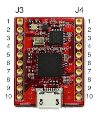
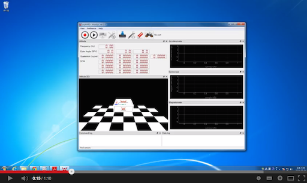
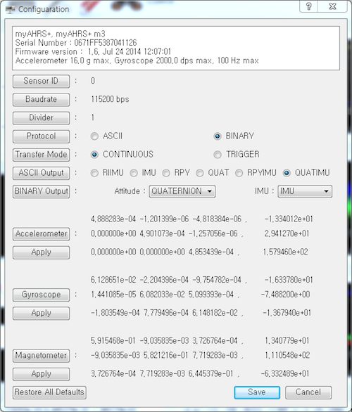
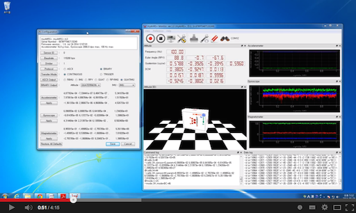
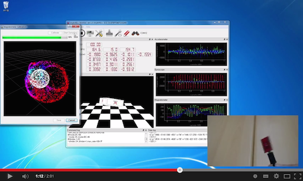
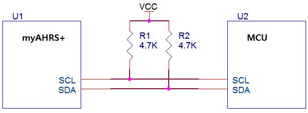
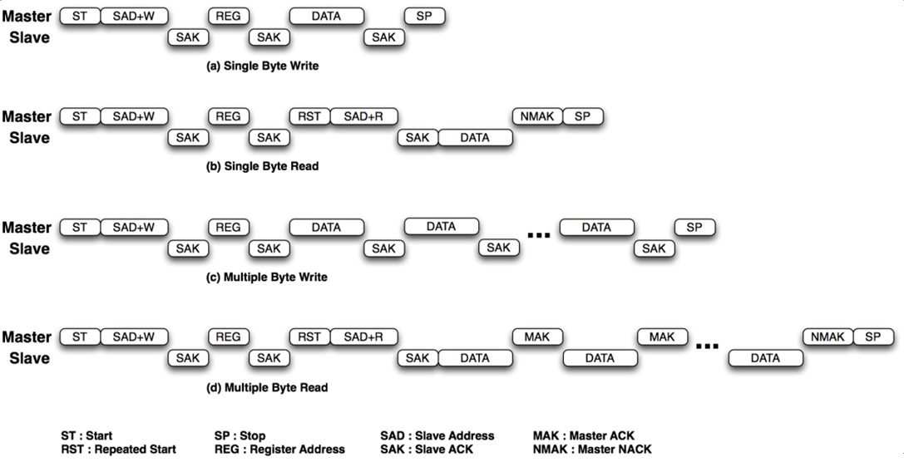

# Introduction

The myAHRS+ is a low cost high performance AHRS(Attitude Heading Reference System). 
Its attitude output is more stable to acceleration and magnetic disturbances then other low cost AHRS/IMU products. 
Communication and configuration are enabled via UART/USB interface for user applications. And I2C interface is available for embedded application like arduino projects.
The GUI(myAHRS+ Monitor) is available, which allows users configure all myAHRS+  settings, view attitude of myAHRS+ and IMU(Inertial Measurement Unit) data in realtime and save sensor data in a text file. Custom user software may be developed using the myAHRS+ SDK.

## Features

* Sensors
  * Triple axis 16-bit gyroscope : ± 2,000 dps
  * Triple axis 16-bit accelerometer : ± 16 g
  * Triple axis 13-bit magnetometer  : ± 1200 μT
* On board software
  * Exteneded Kalman filter
  * max 100 Hz output rate
    * Attitude : Euler angle, Quaternion
    * sensor : acceleration, rotation rate, magnetic field
* Connectivity
  * USB : Virtual COM PORT
  * UART : Standard baud rates up to 460800 bps
  * I2C : up to 1kHz
* GUI(myAHRS+ Monitor)
  * display attitude and sensor data from myAHRS+ on various viewers
  * Configuration
  * magnetometer calibration

## Performance

Performance comparison between myAHRS+ and Razor 9 axis IMU.

Performance comparison between myAHRS+ and MPU9150 MotionFit.

## Pin map

Pin | Name | Type | Description
------|------|------|-------------
J3-1 | INT | O | DATA READY interrupt output
J3-2 | SLEEP | I | Sleep mode selection input: L-sleep mode, H-normal mode. (Normal mode If not connected)
J3-3 | I2C_SCL | I | I2C clock input 
J3-4 | I2C_SDA |  I/O  | I2C data input and output 
J3-5 | USB_DM | I/O | USB D-
J3-6 | USB_DP | I/O | USB D+
J3-7 | NC |   | Do Not Connect
J3-8 | NC |   | Do Not Connect
J3-9 | NC |   | Do Not Connect
J3-10 | NC |   | Do Not Connect
J4-1 | VDD | PWR | +5V power input 
J4-2 | nRST | I | Reset input. L-reset, H-normal
J4-3 | NC |  | Do Not Connect
J4-4 | UART_TX | O | UART transmit
J4-5 | UART_RX | I | UART receive
J4-6 | NC |  | Do Not Connect
J4-7 | NC |  | Do Not Connect
J4-8 | NC |   | Do Not Connect    
J4-9 | NC |   | Do Not Connect    
J4-10| GND | PWR | Power ground. 0V

# Testing the myAHRS+

First, connect myAHRS+ to your PC via USB. And then, check LEDs on myAHRS+. The blinking yellow LED means that myAHRS+ is in normal state. And the red one means that myAHRS+ is connected to PC via USB successfuly. 

The following video shows the tesing procedure of myAHRS+ using GUI(myAHRS+ Monitor). 

# Configuration

Using the myAHRS+ Monitor, user can change various properties of myAHRS+ for user application. 
Some properties are saved in non-volatile memory(flash memory), but others are not. Therefore, the volatile properties should be re-initialized to appropriate values when the user application starts.  

* Non-volatile properties
 * Sensor ID
 * Baudrate of UART interface
 * Sensor calibration parameters
* Volatile properties
 * Divider
 * Protocol
 * Transfer mode
 * ASCII output format
 * BINARY output format
 
To update the myAHRS+ settings(properties), run myAHRS+ Monitor. And then open the 'Configuration' dialog window.

This video shows the setting procedure of myAHRS+ using myAHRS+ Monitor. 

# Calibration

The magnetometer(compass) used to estimate yaw angle of AHRS. To get better measurment of yaw angle, the magnetometer of myAHRS+ should be calibrated by the user at the very place where it'll be used. The following description explains why to do so.

Measurement of magnetic field will be subjected to distortion. There are two categories of these distortions: the hard iron distortions and the soft iron distortions. The hard iron errors refer to the presence of magnetic fields around the sensor  such as magnets, power supply wires are related to the measurement offset errors, while the soft iron errors refer to the presence of the ferromagnetic materials around the sensor which skew the density of the Earth's magnetic field locally, are related to the scaling offset errors. (http://diydrones.com/profiles/blogs/advanced-hard-and-soft-iron-magnetometer-calibration-for-dummies)

This video shows the calibration procedure of myAHRS+ using myAHRS+ Monitor.

# I2C Interface 

### 1. I2C Interface

The myAHRS+ operates as I2C slave and the I2C bus requires the pull-up resistor. 
Normally 4.7kΩ resistor is used but 1kΩ ~ 10kΩ resistor can be used depends on the situation.

The I2C port operates in 3.3V voltage level and can be used directly with a MCU with 5V IO without an extra circuit. 
* I2C Slave address: 7bit, 0x20
* Data bit: 8bit
* I2C clock speed: Normal mode(100KHz), Fast mode(400KHz)

I2C interface of the myAHRS+ supports four sequences shown below.

### 2. I2C Register description

Register Name | Attributes | Address | Dafault value | Description
------|------|------|---------- | ----------------
WHO_AM_I | R | 0x01 | 0xB1 |  -
REV_ID_MAJOR | R | 0x02 | - | -
REV_ID_MINOR | R | 0x03 | - | -
STATUS | R |  0x04  | 0x80 | Sensor status 
I_ACC_X_LOW | R | 0x10 | DATA | Acceleration raw data
I_ACC_X_HIGH | R | 0x11 | DATA | Acceleration raw data
I_ACC_Y_LOW | R | 0x12 | DATA | Acceleration raw data
I_ACC_Y_HIGH | R | 0x13 | DATA | Acceleration raw data
I_ACC_Z_LOW | R | 0x14 | DATA | Acceleration raw data
I_ACC_Z_HIGH | R | 0x15 | DATA | Acceleration raw data
I_GYRO_X_LOW | R | 0x16 | DATA | Gyroscope raw data
I_GYRO_X_HIGH | R | 0x17 | DATA | Gyroscope raw data
I_GYRO_Y_LOW | R | 0x18 | DATA | Gyroscope raw data
I_GYRO_Y_HIGH | R | 0x19 | DATA | Gyroscope raw data
I_GYRO_Z_LOW | R | 0x1A | DATA | Gyroscope raw data
I_GYRO_Z_HIGH | R | 0x1B | DATA | Gyroscope raw data
I_MAGNET_X_LOW | R | 0x1C | DATA | Magnetometer raw data
I_MAGNET_X_HIGH | R | 0x1D | DATA | Magnetometer raw data
I_MAGNET_Y_LOW | R | 0x1E | DATA | Magnetometer raw data
I_MAGNET_Y_HIGH | R | 0x1F | DATA | Magnetometer raw data
I_MAGNET_Z_LOW | R | 0x20 | DATA | Magnetometer raw data
I_MAGNET_Z_HIGH | R | 0x21 | DATA | Magnetometer raw data
C_ACC_X_LOW | R | 0x22 | DATA | Calibrated acceleration data
C_ACC_X_HIGH | R | 0x23 | DATA | Calibrated acceleration data
C_ACC_Y_LOW | R | 0x24 | DATA | Calibrated acceleration data
C_ACC_Y_HIGH | R | 0x25 | DATA | Calibrated acceleration data
C_ACC_Z_LOW | R | 0x26 | DATA | Calibrated acceleration data
C_ACC_Z_HIGH | R | 0x27 | DATA | Calibrated acceleration data
C_GYRO_X_LOW | R | 0x28 | DATA | Calibrated gyroscope data
C_GYRO_X_HIGH | R | 0x29 | DATA | Calibrated gyroscope data
C_GYRO_Y_LOW | R | 0x2A | DATA | Calibrated gyroscope data
C_GYRO_Y_HIGH | R | 0x2B | DATA | Calibrated gyroscope data
C_GYRO_Z_LOW | R | 0x2C | DATA | Calibrated gyroscope data
C_GYRO_Z_HIGH | R | 0x2D | DATA | Calibrated gyroscope data
C_MAGNET_X_LOW | R | 0x2E | DATA | Calibrated magnetometer data
C_MAGNET_X_HIGH | R | 0x2F | DATA | Calibrated magnetometer data
C_MAGNET_Y_LOW | R | 0x30 | DATA | Calibrated magnetometer data
C_MAGNET_Y_HIGH | R | 0x31 | DATA | Calibrated magnetometer data
C_MAGNET_Z_LOW | R | 0x32 | DATA | Calibrated magnetometer data
C_MAGNET_Z_HIGH | R | 0x33 | DATA | Calibrated magnetometer data
TEMPERATURE_LOW | R | 0x34 | DATA | Temperature data
TEMPERATURE_HIGH | R | 0x35 | DATA | Temperature data
ROLL_LOW | R | 0x36 | DATA | Euler angle
ROLL_HIGH | R | 0x37 | DATA | Euler angle
PITCH_LOW | R | 0x38 | DATA | Euler angle
PITCH_HIGH | R | 0x39 | DATA | Euler angle
YAW_LOW | R | 0x3A | DATA | Euler angle
YAW_HIGH | R | 0x3B | DATA | Euler angle
QUATERNION_X_LOW | R | 0x3C | DATA | Quaternion
QUATERNION_X_HIGH | R | 0x3D | DATA | Quaternion
QUATERNION_Y_LOW | R | 0x3E | DATA | Quaternion
QUATERNION_Y_HIGH | R | 0x3F | DATA | Quaternion
QUATERNION_Z_LOW | R | 0x40 | DATA | Quaternion
QUATERNION_Z_HIGH | R | 0x41 | DATA | Quaternion
QUATERNION_W_LOW | R | 0x42 | DATA | Quaternion
QUATERNION_W_HIGH | R | 0x43 | DATA | Quaternion

### 3. Data transform formula

* I_ACC_X_LOW ~ I_MAGNET_Z_HIGH
 * These registers store the sensor output value that is not compensated by the calibration parameter. Lower 8bit is saved in a LOW register and higher 8bit register is saved in a HIGH register. Since the value is originally Integer, there is no need to convert it into a Real number.

* C_ACC_X_LOW ~ C_ACC_Z_HIGH
 * These registers store the acceleration output value (signed 16bit) that is compensated by the calibration parameter. Lower 8bit is saved in a LOW register and higher 8bit register is saved in a HIGH register. Multiplying a scale factor (16 / 32767) converts the unit of acceleration value into the (g) unit.
 * Acceleration(g) = C_ACC × 16 / 32767

* C_GYRO_X_LOW ~ C_ GYRO _Z_HIGH
 * These registers store the gyroscope output value (signed 16bit) that is compensated by the calibration parameter. Lower 8bit is saved in a LOW register and higher 8bit register is saved in a HIGH register. Multiplying a scale factor (2000 / 32767) converts the unit of gyroscope value into the (dps / degree per second) unit.
 * Gyroscope(dps) = C_GYRO × 2000 / 32767

* C_MAGNET_X_LOW ~ C_ MAGNET _Z_HIGH
 * These registers store the magnetometer output value (signed 16bit) that is compensated by the calibration parameter. Lower 8bit is saved in a LOW register and higher 8bit register is saved in a HIGH register. The output value of a calibrated magnetometer sensor is not required to convert into a Real number, because there is no physical unit.
 * If you need magnetic field measurement, multiply the scale factor 0.3 to not-calibrated magnetometer output (I_MAGNET_X_LOW ~ I_MAGNET_Z_HIGH) then you can get the magnetic field measurement in uT.
 * Magnetometer(uT) = I_MAGNET × 0.3

* TEMPERATURE_LOW ~ TEMPERATURE_HIGH
 * These registers store the temperature output value (signed 16bit). Lower 8bit is saved in a LOW register and higher 8bit register is saved in a HIGH register. Multiplying a scale factor (200 / 32767) converts the unit of the temperature value into the (℃) unit.
 * Temperature(℃) = TEMPERATURE_N × 200 / 32767

* ROLL_LOW ~ YAW_HIGH
 * These registers store the Euler angle output value (signed 16bit). Lower 8bit is saved in a LOW register and higher 8bit register is saved in a HIGH register. Multiplying a scale factor (180 / 32767) converts the unit of the angle value into the (°) unit.
 * Euler angle(°) = ROLL(PITCH, YAW) × 180 / 32767

* QUATERNION_X_LOW ~ QUATERNION_W_HIGH
 * These registers store the quaternion output value (signed 16bit). Lower 8bit is saved in a LOW register and higher 8bit register is saved in a HIGH register. Multiplying a scale factor (1 / 32767) converts the value into the Real number.
 * Quaternion = X(Y, Z, W) / 32767

# UART Protocol

Describes the details of various messages used for communicating with myAHRS+ using serial port (USB/UART). 
This will help you getting the sensor data and changing the settings.

### 1. Message frame definition
myAHRS+ message format

Header | Function
------|------
@,~,$ | Start of Communication Frame
\r\n | End of Communication Frame
\* | CRC delimeter

Request message
* A message from the Host(PC) to the sensor
* [@][body(N byte)][*][CRC(2byte)][\r\n] 

Response Message
* A message from the sensor to the Host(PC) Request message
* [~][body(N byte)][*][CRC(2byte)][\r\n] 

Data Message
* Supports ASCII and BINARY formats
* A message independent of Response message for Request message, sent to the Host which includes various sensor data
* [$][body(N byte)][*][CRC(2byte)][\r\n] 

Request message is a user command transferred to the sensor which starts with ‘@’, and the sensor Response message starts with ‘~’.
* The first field of the Request message is a command, and the N (N~0) parameters followed from the second field.
* The first field of the Response message is same to the first field of the Request message.
* The second field of the Response message is a status, “OK” or “ERROR”.
* The N (N~0) parameters followed from the third field of the Response message.
 * The parameters of the Response message are the attributes. ‘attribute name’=’attribute value’.
* When it is not possible to execute command with such as a CRC error, the output will be an error message.

The Data message is a message with various data including sensor attitude, transfers regardless of Request & Response messages.
* Output based on user setting output rate when in Continuous Mode.
* Output based on user request when in Trigger Mode.

The details of Data message will be described in Section 3 Data Message.
Above body of all messages consisted of M fields delimited with delimit character (,).
CRC is a value expressed in ASCII with ‘exclusive or’ value in bite unit from the frame starting point to the end of the body.
* For example, if the CRC value is 0x1A, the expression is “1A”.
* There should be no space or blank between the CRC value and ‘*’.

Example of command & response
* Version request: “@version*3A”
* Version response: “~version,OK,product=myAHRS+,platform=myAHRS+m3,sn=464432970808430886,ver=1.6,build=Jul 24 2014 12:07:01*6F”

### 2. Command & Response Message Details
For the convenience of explanation, CRC field (“*XX”) and frame end (\r\n) are omitted in command examples.

##### 2.1 Firmware Version
Requests common information such as the product name, firmware version, sensor serial number and so on…
* Request: @version
* Response: ~version,OK,product=myAHRS+,platform=myAHRS+m3,sn=464432970808430886,ver=1.5,build=Jul 13 2014 22:50:17
* Attribute

| Attribute name | Description |
| ------|------ |
| product | Product name |
| platform | Board information |
| sn | Sensor serial number |
| ver | Firmware version |
| build | Build date |

##### 2.2 Sensor Serial Number
* Request: @sn
* Response: ~sn,OK,sn=sensor serial number
* Attribute

| Attribute name | Description |
| ------|------ |
| sn | Sensor serial number |

##### 2.3 Sensor ID
A sensor ID user can set. When using multiple sensors, using sensor and PC communication port (COM3 for example) as a sensor distinguisher is difficult so, sensor ID is used. 
Available sensor ID range is 0~65535 and when the command executes without the parameter (ID), the output is the current set ID.
* Request: @id,ID
* Response: ~id,OK,id=ID
* Attribute

| Attribute name | Description |
| ------|------ |
| id | Sensor ID |

##### 2.4 Sensor Sensitivity
The measuring range and sensitivity output of Accelerometer/Gyro Sensor.
* Request: @sensitivity
* Response: ~sensitivity,OK,acc range=16,gyro range=2000,acc sensitivity=4.882813e-04,gyro sensitivity=6.097561e-02
* Attribute

| Attribute name | Description |
| ------|------ |
| acc_range | Accelerometer measuring range(g) |
| gyro_range | Gyroscope measuring range(dps) |
| acc_sensitivity | Accelerometer sensitivity(g/LSB) |
| gyro_sensitivity | Gyroscope sensitivity(dps/LSB) |

##### 2.5 Data Output Mode
Select output mode for sensor message format and output type.
* ‘A’: Set ASCII format for data message
* ‘B’: Set BINARY format for data message
* ‘C’: Continuous mode. Continuous output according to the user specified output rate
* ‘T’: Trigger mode. Output according to the user request

To change the output mode, use the combination of above characters (MODE_STRING). 
For example, use “AC” to set ASCII format in Continuous mode. Running command without the parameters will display the current settings. 
If you specify the data message in BINARY form, you may take the difficult in protocol processing implementation. So, if you need to analyze the data message directly not using myAHRS+ SDK, we recommend you ASCII format for the data message in this case.
* Request: @mode,MODE_STRING
* Response: ~mode,OK,mode=MODE STRING
* Attribute

| Attribute name | Description |
| ------|------ |
| mode | Output mode |
* Example: ASCII format & Continuous output => @mode,AC

##### 2.6 Data Output format(ASCII) setting
Select output data message format (ASCII_FORMAT), when you specify the data message output mode in ASCII format. Supported message formats are listed below.

| Message Type | Description |
| ------|------ |
| RIIMU | IMU sensor raw data(integer) output |
| IMU | A compensated IMU sensor output value with the calibration parameter |
| RPY | Sensor attitude output in EULER |
| QUAT | Sensor attitude output in quaternion |
| RPYIMU | RPY + IMU |
| QUATIMU | QUAT + IMU |  

* Run command without the parameters will display the current settings. The details for each format will be described in chapter 3 data message.
* Request: @asc_out,ASCII_FORMAT
* Response: ~asc_out,OK,fmt=ASCII_FORMAT
* Attribute

| Attribute name | Description |
| ------|------ |
| fmt | Message format name |
* Example: To display quaternion & IMU data => @asc_out,QUATIMU

##### 2.7 Data Output format(BINARY) setting
Select data output when the data output mode is in BINARY format.
* Attitude
 * EULER: EULER angle output
 * QUATERNION: QUATERNION output
* IMU
 * RIIMU: Uncompensated sensor value (acceleration, gyroscope, magnetometer, temperature)
 * IMU: Compensated sensor value (acceleration, gyroscope, magnetometer, temperature)

Specify output entries combine above using BINARY_FORMAT. No ‘,’ in BINARY_FORMAT. 
If you specify the data message in BINARY form, you may take the difficult in protocol processing implementation. So, if you need to analyze the data message directly not using myAHRS+ SDK, we recommend you ASCII format for the data message in this case.
* Request: @bin out,BINARY FORMAT
* Response: ~bin out,OK,fmt=BINARY FORMAT
* Attribute

| Attribute name | Description |
| ------|------ |
| fmt | Message format name |
* Example
 * @bin out,EULER RIIMU: Display EULER angle and uncompensated sensor value
 * @bin out,IMU: Display compensated sensor value only

##### 2.8 Data Request
A sensor data request command when the data output mode is in trigger mode. Data message output instead of the command response. Error response will return when it is in continuous mode.
* Request: @trig
* Response: None

##### 2.9 Data Output Rate Setting
Data output rate setting when the data message output mode is in continuous mode. 
Output rate will be determined by dividing the sensor maximum output frequency with the user input divider. Let’s say the maximum output frequency is 100 Hz and the divider is 5, the data output frequency is 20 Hz. For the response for this command, the user input divider and the maximum output frequency will be displayed. 
Run command without the parameters, current settings will be displayed.
* Request: @divider,DIVIDER
* Response: ~divider,OK,divider=DIVIDER,max rate=100
* Attribute

| Attribute name | Description |
| ------|------ |
| divider | Divider value |
| max_rate | Maximum output frequency |
* Example: Set divider 1 => @divider,1

##### 2.10 Change Sensor Calibration Parameter
Change calibration parameter for each sensor(acceleration, gyroscope and magnetometer). Current settings will be displayed without the CALIBRATION_PARAMETERS.
* Request: @calib, SENSOR TYPE, CALIBRATION PARAMETERS
* SENSOR_TYPE
 * ‘A’: Accelerometer
 * ‘G’: Gyroscope
 * ‘M’: Magnetometer
* CALIBRATION PARAMETERS
 * T₁₁, T₁₂, T₁₃, T₂₁, T₂₂, T₂₃, T₃₁, T₃₂, T₃₃, b₁, b₂, b₃
* Response: ~calib,OK,sensor=SENSOR TYPE,param= CALIBRATION PARAMETERS
* Attribute

| Attribute name | Description |
| ------|------ |
| sensor | Sensor type |
| param | Calibration parameter |
* Example: @calib,A,1.000000e+00,2.000000e+00,3.000000e+00,4.000000e+00,5.000000e+00,6.000000e+00,7.000000e+00,8.000000e+00,9.000000e+00,1.000000e+01,1.100000e+01,1.200000e+01

##### 2.11 Change Baud Rate
Change UART interface baud-rate. myAHRS+ supports the baud-rates listed below.
* 9600, 14400, 19200, 38400, 57600, 115200, 230400, 460800

When it receives the baud-rate change command, it sends the response and changes the baud-rate to the user specified value. Run command without the parameters will display the current settings.
* Request: @baudrate,BAUDRATE
* Response: ~baudrate,OK,baudrate=BAUDRATE
* Attribute

| Attribute name | Description |
| ------|------ |
| baudrate | Baudrate |
* Example: Set baud-rate 115200 bps => @baudrate,115200

##### 2.12 Save User Setting
NVRAM storable user settings are listed below.
* Sensor ID
* UART Baudrate
* Calibration parameter
* User coordinate

Other than listed above settings will not be saved in NVRAM, so you need to set them every time when the sensor initializes.
* Request: @save
* Response: ~save,OK

##### 2.13 Factory Setting
Set every setting to default (factory setting) value.
* Request: @factory
* Response: ~factory,OK

### 3. Data Message
##### 3.1 ASCII Format Message
* RIIMU
 * Format: $RIIMU,sequence number,accel_x,accel_y,accel_z,gyro_x,gyro_y,gyro_z, magnet_x,magnet_y,magnet_z,temperature
 * Example: $RIIMU,27,25,26,-1901,-16,-7,-11,259,-147,55,158
* IMU
 * Format: $IMU,sequence number,accel_x,accel_y,accel_z,gyro_x,gyro_y,gyro_z, magnet_x,magnet_y,magnet_z,temperature
 * Example: $IMU,60,0.0297,0.0019,-1.0056,0.0153,-0.0282,0.3487,129.5813,-110.5982,142.4527,35.5
* RPY
 * Format: $RPY,sequence number,roll,pitch,yaw
 * Example: $RPY,68,0.04,1.56,34.22
* QUAT
 * Format: $QUAT,sequence number,x,y,z,w
 * Example: $QUAT,55,-0.0037,0.0134,0.2932,0.9560
* RPYIMU
 * Format: $RPYIMU,sequence number,roll,pitch,yaw,accel_x,accel_y,accel_z,gyro_x,gyro_y,gyro_z, magnet_x,magnet_y,magnet_z,temperature
 * Example: $RPYIMU,82,0.04,1.67,34.07,0.0307,0.0014,-1.0095,-0.0435,0.0919,0.1660,137.2258,-90.1564,134.8918,35.6
* QUATIMU
 * Format: $QUATIMU,sequence number,x,y,z,w,accel_x,accel_y,accel_z,gyro_x,gyro_y,gyro_z, magnet_x,magnet_y,magnet_z,temperature
 * Example: $QUATIMU,02,-0.0039,0.0135,0.2940,0.9557,0.0238,0.0034,-0.9978,-0.0448,-0.0896,0.2866,136.5006,-86.5058,134.0961,35.8

##### 3.2 BINARY Format Message
If you specify the data message in BINARY form, you may take the difficult in protocol processing implementation. 
So, if you need to analyze the data message directly not using myAHRS+ SDK, we recommend you ASCII format for the data message in this case. 
With myAHRS+ SDK, user does not need to implement sensor data message interpretation, we omit the details on this in user’s guide.

# Examples

Some useful examples for using the myAHRS+ are available for various platforms.

* [myAHRS+ SDK](../common_cpp).
* [python](../common_python).
* [odroid XU3](../odroid_xu3).
* [odroid C1](../odroid_c1).
* [Raspberry PI](../raspberry_pi)
* I2C Examples
 * [myCortex-STM32F4](https://github.com/withrobot/myCortex-STM32F4/tree/master/ex09.4_I2C_myAHRS%2B).
 * [Arduino I2C example](../arduino)
* UART Examples
 
